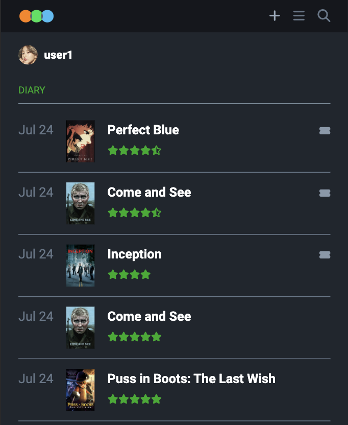
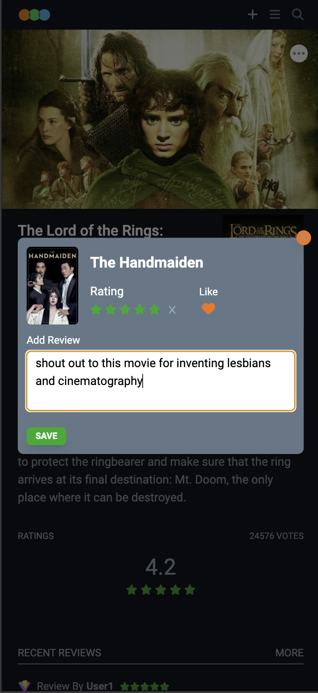
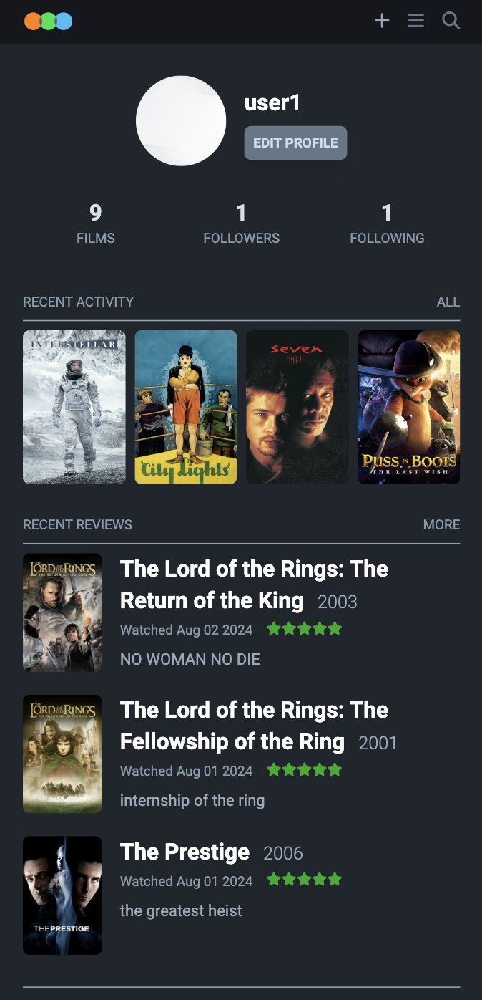

# MovieMosaic

Basic [Letterboxd]("https://letterboxd.com/") Clone

## Features

1. Explore film database with search functionality, filtering, pagination and sorting options.
2. Users can add movies to their watchlist, like, rate and review movies.
3. Users can log their watched movies.
4. User can view other user's profile and see their activities.
5. Allow user to update their profile info, avatar and password.

## Screenshots







## How to run Locally

#### Install Dependencies

```sh
cd server
npm install
```

Setup your environment similar to **.env.example** file

#### Migrate Table Schema

```sh
npm run migrate
```

#### Seed Film Table

```sh
npm run seed
```

#### Run Local Server

```sh
npm run start
```

#### Navigate to client directory and start the server

```sh
cd ../client
npm  install
npm run dev
```
